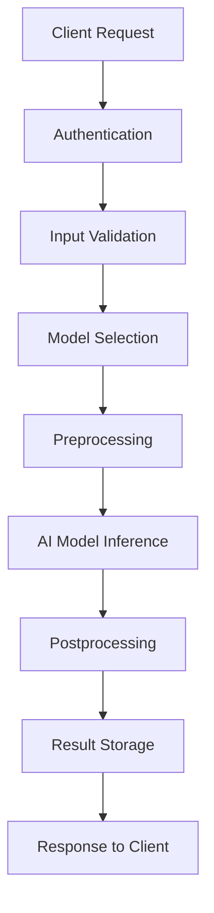

# AI Model Documentation

## Model Purpose and Overview

### Primary Objectives
The AI Analyzer leverages large language models (LLMs) to perform comprehensive analysis of transcribed content. The system is designed to extract meaningful insights from conversational data including customer calls, and other audio transcriptions.

### Core Analysis Capabilities
1. **Sentiment Analysis**: Determine emotional tone and sentiment polarity
2. **Entity Extraction**: Identify key people, organizations, locations, and concepts
3. **Topic Modeling**: Discover main themes and discussion points
4. **Summary Generation**: Create concise summaries of lengthy transcriptions
5. **Intent Recognition**: Understand user intentions and action items
6. **Emotion Detection**: Identify specific emotional states beyond basic sentiment

### Use Cases
- **Business Intelligence**: Analyze customer feedback and support calls
- **Content Analysis**: Process interview transcripts and focus group discussions
- **Quality Assurance**: Monitor call center performance and compliance


## Supported Model Providers

### 1. OpenAI (Primary Provider)

#### Available Models
- **GPT-4**: Most capable model for complex reasoning and analysis
- **GPT-3.5 Turbo**: Fast and cost-effective for most analysis tasks
- **GPT-4 Turbo**: Latest model with extended context window

#### Configuration
```python
OPENAI_CONFIG = {
    "provider": "openai",
    "model_name": "gpt-4.1-nano",
    "temperature": 0.3,
    "max_tokens": 2000,
    "top_p": 1.0,
    "frequency_penalty": 0.0,
    "presence_penalty": 0.0
}
```

#### Strengths
- Excellent instruction following
- High-quality reasoning and analysis
- Consistent output formatting
- Strong multilingual support

### 2. Groq (High-Speed Inference)

#### Available Models
- **Llama-3-70B**: Large model for complex tasks
- **Llama-3-8B**: Smaller model for faster inference
- **Mixtral-8x7B**: Mixture of experts model

#### Configuration
```python
GROQ_CONFIG = {
    "provider": "groq",
    "model_name": "llama3-70b-8192",
    "temperature": 0.2,
    "max_tokens": 1500,
    "stream": false
}
```

#### Strengths
- Extremely fast inference
- Cost-effective for high-volume processing
- Good performance on analytical tasks

### 3. Ollama (Local Deployment)

#### Available Models
- **Llama 2**: Open-source alternative
- **Mistral**: Efficient European model
- **CodeLlama**: Specialized for technical content

#### Configuration
```python
OLLAMA_CONFIG = {
    "provider": "ollama",
    "model_name": "llama2:13b",
    "base_url": "http://localhost:11434",
    "temperature": 0.4,
    "num_predict": 1000
}
```

#### Strengths
- No external API dependencies
- Data privacy and security
- Customizable and fine-tunable

### 4. HuggingFace (Open Source Models)

#### Available Models
- **BERT variants**: For classification tasks
- **RoBERTa**: Robust BERT optimization
- **DistilBERT**: Lightweight alternative

#### Configuration
```python
HUGGINGFACE_CONFIG = {
    "provider": "huggingface",
    "model_name": "cardiffnlp/twitter-roberta-base-sentiment-latest",
    "device": "cuda" if torch.cuda.is_available() else "cpu",
    "batch_size": 16
}
```

## Analysis Types and Prompts

### 1. Sentiment Analysis

#### Prompt Template
```
Analyze the sentiment of the following transcription. Provide:

1. Overall sentiment (positive, negative, neutral)
2. Sentiment score (-1.0 to 1.0)
3. Confidence level (0.0 to 1.0)
4. Key phrases that indicate sentiment
5. Emotional breakdown (joy, anger, fear, sadness, etc.)

Transcription:
{transcription_text}

Respond in JSON format:
{
  "overall_sentiment": "positive|negative|neutral",
  "sentiment_score": 0.75,
  "confidence": 0.92,
  "key_phrases": [
    {"phrase": "excellent work", "sentiment": "positive", "confidence": 0.95}
  ],
  "emotions": {
    "joy": 0.6,
    "confidence": 0.8,
    "neutral": 0.2
  }
}
```

#### Expected Output Schema
```python
class SentimentAnalysisResult(BaseModel):
    overall_sentiment: str
    sentiment_score: float
    confidence: float
    key_phrases: List[Dict[str, Union[str, float]]]
    emotions: Dict[str, float]
    processing_metadata: Dict[str, Any]
```

### 2. Entity Extraction

#### Prompt Template
```
Extract and classify entities from the following transcription:

Categories to identify:
- PERSON: Names of people
- ORGANIZATION: Companies, institutions
- LOCATION: Places, addresses
- DATE: Dates and time references
- MONEY: Monetary amounts
- GOAL: Objectives, targets
- ACTION_ITEM: Tasks or actions mentioned

Transcription:
{transcription_text}

Respond in JSON format:
{
  "entities": [
    {
      "text": "John Smith",
      "type": "PERSON",
      "confidence": 0.98,
      "start_position": 45,
      "end_position": 55
    }
  ]
}
```

### 3. Topic Modeling

#### Prompt Template
```
Identify the main topics and themes discussed in this transcription:

1. Extract 3-5 primary topics
2. Provide topic weights (importance)
3. Identify key keywords for each topic
4. Suggest topic labels

Transcription:
{transcription_text}

Respond in JSON format:
{
  "topics": [
    {
      "label": "Q4 Financial Planning",
      "weight": 0.35,
      "keywords": ["budget", "revenue", "Q4", "targets"],
      "description": "Discussion about fourth quarter financial goals"
    }
  ]
}
```

### 4. Summary Generation

#### Prompt Template
```
Create a comprehensive summary of this transcription:

Requirements:
- 3-4 sentence executive summary
- Key points (bullet format)
- Action items with assignees (if mentioned)
- Important decisions made
- Next steps or follow-ups

Transcription:
{transcription_text}

Respond in JSON format:
{
  "executive_summary": "Brief overview in 3-4 sentences...",
  "key_points": ["Point 1", "Point 2", "Point 3"],
  "action_items": [
    {
      "task": "Complete Q4 budget review",
      "assignee": "John Smith",
      "deadline": "Next Friday"
    }
  ],
  "decisions": ["Approved new hiring plan"],
  "next_steps": ["Schedule follow-up meeting"]
}
```

## Model Training and Fine-tuning

### Training Data Requirements

#### Data Sources
- **Internal Transcriptions**: Domain-specific conversation data
- **Public Datasets**: Common Voice, LibriSpeech for general language patterns
- **Annotated Examples**: Human-labeled sentiment and entity data
- **Quality Assurance**: Validated ground truth data for evaluation

#### Data Preprocessing
```python
def preprocess_training_data(raw_transcriptions):
    """
    Preprocess transcription data for model training
    """
    processed_data = []
    
    for transcription in raw_transcriptions:
        # Clean text
        cleaned_text = clean_transcription_text(transcription.content)
        
        # Tokenization
        tokens = tokenize_text(cleaned_text)
        
        # Label preparation
        labels = prepare_labels(transcription.annotations)
        
        processed_data.append({
            "text": cleaned_text,
            "tokens": tokens,
            "labels": labels,
            "metadata": transcription.metadata
        })
    
    return processed_data
```

### Model Performance Metrics

#### Sentiment Analysis Metrics
- **Accuracy**: Overall classification accuracy
- **Precision/Recall**: Per-class performance
- **F1-Score**: Harmonic mean of precision and recall
- **ROC-AUC**: Area under the receiver operating characteristic curve

#### Entity Extraction Metrics
- **Exact Match**: Percentage of perfectly identified entities
- **Partial Match**: Entities with correct type but approximate boundaries
- **Type Accuracy**: Correct entity classification regardless of boundaries

#### Benchmark Results
```python
PERFORMANCE_BENCHMARKS = {
    "sentiment_analysis": {
        "accuracy": 0.94,
        "precision": {"positive": 0.93, "negative": 0.91, "neutral": 0.96},
        "recall": {"positive": 0.95, "negative": 0.89, "neutral": 0.94},
        "f1_score": 0.93
    },
    "entity_extraction": {
        "exact_match": 0.87,
        "partial_match": 0.92,
        "type_accuracy": 0.95
    },
    "topic_modeling": {
        "coherence_score": 0.68,
        "silhouette_score": 0.42
    }
}
```

## Inference Process

### Request Flow


### Inference Pipeline

#### 1. Input Preprocessing
```python
async def preprocess_input(transcription_text: str, analysis_config: dict):
    """Prepare input for model inference"""
    
    # Text cleaning
    cleaned_text = clean_text(transcription_text)
    
    # Chunk long transcriptions
    if len(cleaned_text) > MAX_CONTEXT_LENGTH:
        chunks = chunk_text(cleaned_text, MAX_CONTEXT_LENGTH)
    else:
        chunks = [cleaned_text]
    
    # Prepare model-specific formatting
    formatted_input = format_for_model(chunks, analysis_config)
    
    return formatted_input
```

#### 2. Model Inference
```python
async def perform_inference(input_data: dict, model_config: dict):
    """Execute model inference"""
    
    provider = get_ai_provider(model_config["provider"])
    
    try:
        start_time = time.time()
        
        result = await provider.analyze(
            text=input_data["text"],
            analysis_type=input_data["analysis_type"],
            config=model_config
        )
        
        processing_time = time.time() - start_time
        
        return {
            "result": result,
            "processing_time": processing_time,
            "model_used": model_config["model_name"],
            "provider": model_config["provider"]
        }
        
    except Exception as e:
        logger.error(f"Inference failed: {str(e)}")
        raise AIInferenceError(f"Model inference failed: {str(e)}")
```

#### 3. Result Postprocessing
```python
async def postprocess_results(raw_results: dict, analysis_type: str):
    """Process and validate model outputs"""
    
    # Validate output format
    validated_results = validate_output_schema(raw_results, analysis_type)
    
    # Apply confidence thresholds
    filtered_results = apply_confidence_filters(validated_results)
    
    # Enhance with metadata
    enhanced_results = add_processing_metadata(filtered_results)
    
    return enhanced_results
```

## Model Versioning and Updates

### Version Control Strategy

#### Model Registry
```python
MODEL_REGISTRY = {
    "sentiment_analyzer": {
        "v1.0": {
            "provider": "openai",
            "model_name": "gpt-3.5-turbo",
            "deployment_date": "2025-01-01",
            "performance_metrics": {...},
            "status": "deprecated"
        },
        "v1.1": {
            "provider": "openai",
            "model_name": "gpt-4-1106-preview",
            "deployment_date": "2025-01-15",
            "performance_metrics": {...},
            "status": "active"
        }
    }
}
```

#### Model Deployment Process
1. **Development**: Train/fine-tune new model version
2. **Validation**: A/B testing against current production model
3. **Staging**: Deploy to staging environment for integration testing
4. **Gradual Rollout**: Progressive deployment to production traffic
5. **Monitoring**: Performance tracking and rollback capability

### A/B Testing Framework
```python
async def run_ab_test(transcription_id: int, test_config: dict):
    """Compare performance between model versions"""
    
    # Get transcription
    transcription = await get_transcription(transcription_id)
    
    # Run analysis with both models
    control_result = await analyze_with_model(
        transcription.content, 
        test_config["control_model"]
    )
    
    treatment_result = await analyze_with_model(
        transcription.content, 
        test_config["treatment_model"]
    )
    
    # Compare results
    comparison = compare_analysis_results(control_result, treatment_result)
    
    # Log test results
    await log_ab_test_result(transcription_id, comparison)
    
    return comparison
```

### Model Update Procedures

#### Automated Model Updates
```python
class ModelUpdater:
    async def check_for_updates(self):
        """Check for new model versions from providers"""
        for provider in self.providers:
            available_models = await provider.list_models()
            current_models = self.get_current_models(provider.name)
            
            new_models = self.find_new_versions(available_models, current_models)
            if new_models:
                await self.evaluate_new_models(new_models)
    
    async def evaluate_new_models(self, models: List[str]):
        """Evaluate new models against benchmark dataset"""
        for model in models:
            performance = await self.run_benchmark_tests(model)
            if performance.meets_criteria():
                await self.schedule_gradual_rollout(model)
```

#### Manual Model Updates
1. **Configuration Update**: Modify model settings in environment variables
2. **Application Restart**: Restart services to load new configuration
3. **Verification**: Run health checks and validation tests
4. **Monitoring**: Monitor performance metrics and error rates

## Error Handling and Fallbacks

### Fallback Strategy
```python
async def analyze_with_fallback(text: str, analysis_type: str, config: dict):
    """Attempt analysis with fallback models"""
    
    primary_provider = config["provider"]
    fallback_providers = get_fallback_providers(primary_provider)
    
    for provider_name in [primary_provider] + fallback_providers:
        try:
            provider = get_ai_provider(provider_name)
            result = await provider.analyze(text, analysis_type, config)
            
            # Log successful provider
            logger.info(f"Analysis completed with {provider_name}")
            return result
            
        except Exception as e:
            logger.warning(f"Provider {provider_name} failed: {str(e)}")
            continue
    
    # All providers failed
    raise AIServiceUnavailableError("All AI providers unavailable")
```

### Rate Limiting and Quotas
```python
class RateLimiter:
    def __init__(self):
        self.provider_limits = {
            "openai": {"requests_per_minute": 60, "tokens_per_minute": 150000},
            "groq": {"requests_per_minute": 100, "tokens_per_minute": 200000}
        }
    
    async def check_rate_limit(self, provider: str, tokens: int) -> bool:
        """Check if request is within rate limits"""
        current_usage = await self.get_current_usage(provider)
        limits = self.provider_limits[provider]
        
        if current_usage["requests"] >= limits["requests_per_minute"]:
            return False
        if current_usage["tokens"] + tokens >= limits["tokens_per_minute"]:
            return False
        
        return True
```

---

**Next**: Check the Usage Guide for end-user instructions and common workflows.